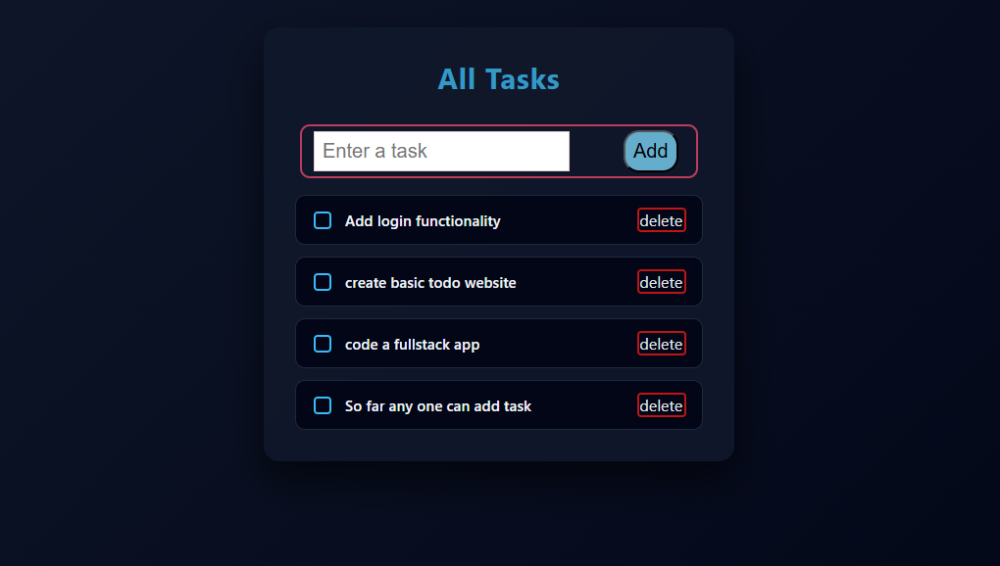

## 🎯 v1.0 
# 📝 Todo List App (React + Appwrite)

full-stack **Todo List application** built with **React** on the frontend and **Appwrite** as the backend & database.
Create tasks, mark them complete, and delete them — all in real time.

Live demo:
👉 **[https://todo-list.appwrite.network/](https://todo-list.appwrite.network/)**

---

## ✨ Features

* ➕ Add new tasks
* ✅ Mark tasks as completed
* ❌ Delete tasks
* ⚡ Real-time database with Appwrite
* 🎨 Clean dark UI with neon accents
* ☁️ Fully deployed & production-ready

---

## 🛠 Tech Stack

| Layer    | Technology                      |
| -------- | ------------------------------- |
| Frontend | React JS                        |
| Backend  | Appwrite                        |
| Database | Appwrite Database               |
| Hosting  | Appwrite Cloud + Static Hosting |

---

## 🚀 Getting Started Locally

### 1. Clone the repository

```bash
git clone https://github.com/hlakokabelo/todo_list.git
cd todo_app
```

### 2. Install dependencies

```bash
npm install
```

### 3. Configure Appwrite

Create an `.env` file in the root:

```env
VITE_APPWRITE_URL=https://cloud.appwrite.io/v1
VITE_APPWRITE_PROJECT_ID=YOUR_PROJECT_ID
VITE_APPWRITE_DATABASE_ID=YOUR_DATABASE_ID
VITE_APPWRITE_COLLECTION_ID=YOUR_COLLECTION_ID
```

> Make sure your Appwrite collection has:
>
> * `body` (string)
> * `completed` (boolean)

### 4. Run the app

```bash
npm run dev
```

---

## 📸 Preview



---

## 📦 Appwrite Setup Summary

1. Create a project on Appwrite
2. Create a database
3. Create a collection called `todos`
4. Add attributes:

   * `body` → string
   * `completed` → boolean
5. Set permissions to allow read/write for users

---

## 🎯 Future Improvements

* User authentication
* Task filters (completed / pending)
* Due dates
* Drag & drop reordering
* Mobile UI polish

